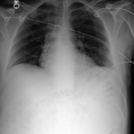
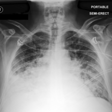
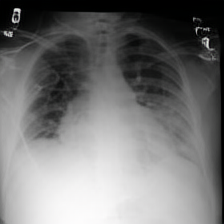

# Addressing Asynchronicity in Clinical Multimodal Fusion via Individualized Chest X-ray Generation

This is the implementation of *DDL-CXR* [Paper]().

Integrating multi-modal clinical data, such as electronic health records (EHR) and chest X-ray images (CXR), is particularly beneficial for clinical prediction tasks. However, in a temporal setting, multi-modal data are often inherently asynchronous. EHR can be continuously collected but CXR is generally taken with a much longer interval due to its high cost and radiation dose. When clinical
prediction is needed, the last available CXR image might have been outdated, leading to suboptimal predictions. To address this challenge, we propose DDL-CXR, a method that dynamically generates an up-to-date latent representation of the individualized CXR images. Our approach leverages latent diffusion models for patient-specific generation strategically conditioned on a previous CXR image
and EHR time series, providing information regarding anatomical structures and disease progressions, respectively. In this way, the interaction across modalities could be better captured by the latent CXR generation process, ultimately improving the prediction performance. 


<table>
  <tr>
    <td align="center">
      
      <br>
      (a) Initial Chest X-ray
    </td>
    <td align="center">
      
      <br>
      (b) CXR taken after 34 hours
    </td>
    <td align="center">
      
      <br>
      (c) Generated by ddlcxr
    </td>
  </tr>
</table>

A real ICU patient with rapid CXR changes.
(a) *Initial radiology findings*: Low lung volumes but lungs are clear of consolidation or pulmonary vascular congestion. No acute cardiopulmonary process.
(b) *Radiology findings after 34 hours*: Severe relatively symmetric **bilateral pulmonary consolidation**.
(c) CXR generated by ddlcxr given the initial CXR image shown in (a) and the EHR data within the 34 hours. Clear signs of bilateral pulmonary consolidation can be seen from the generated image. The visualization shows that **ddlcxr could generate updated CXR images that respect the anatomical structure of the patient and reflect the disease progression**.

<!--    -->

## Set environment

```shell
git clone https://github.com/Chenliu-svg/DDL-CXR.git

conda create -n ddl_cxr python=3.8 
conda activate ddl_cxr
# CUDA 11.1
pip install torch==1.9.1+cu111 torchvision==0.10.1+cu111 -f https://download.pytorch.org/whl/torch_stable.html
pip install -r requirements.txt
pip install taming-transformers-rom1504


```

## Data pre-processing


1. Extract EHR data and task(e.g. phenotype classification and mortality prediction) labels for ICU stays from MIMIC-IV following  [`mimic4extract/README.md`](mimic4extract/README.md)

2. Download the [MIMIC-CXR-JPG](https://physionet.org/content/mimic-cxr-jpg/2.0.0/)


3. Build the datasets for each step(Optional)  [TODO]
Specify the required data path  following instructions in [`pre_processing.py`](pre_processing.py) and run the commend to produce the datasets for each step. (Note: You can skip the this part by utilizing the data processed by us in `./data_pre`.
)

   ```bash

   mimic_cxr_jpg_dir="/path/to/mimic_cxr_jpg" # e.g. /root/autodl-tmp/0807_version/physionet.org/files/mimic-cxr-jpg/2.0.0/
   mimic_iv_csv_dir="/path/to/mimic_iv_csv" #  e.g. /root/autodl-tmp/0807_version/physionet.org/files/mimiciv/2.0/
   mimic_iv_subjets_dir="/path/to/mimic_iv_subjets" # e.g. /root/autodl-tmp/dynamic-prediction/data/mimic_iv_subjects_dir
   metadata_path="/path/to/save/meta/csv/files/,/pickle/ehr/and/generated/latent/cxr" # /root/autodl-tmp/dynamic-prediction/data

   python pre_processing.py \
   --mimic_cxr_jpg_dir $mimic_cxr_jpg_dir \
   --mimic_iv_csv_dir $mimic_iv_csv_dir \
   --mimic_iv_subjects_dir $mimic_iv_subjects_dir \
   --output_csv_dir $metadata_path
   ```

4. pickle the EHR for LDM stage and prediction stage(including z1 generation and final prediction) for faster EHR retrieval

   ```bash
   
   mimic_iv_subjects_dir="/path/to/mimic_iv_subjects_dir" # e.g. /root/autodl-tmp/dynamic-prediction/data/mimic_iv_subjects_dir
   metadata_path="/path/to/save/meta/csv/files/,/pickle/ehr/and/generated/latent/cxr" # e.g. /root/autodl-tmp/dynamic-prediction/data


   python pickle_ehr.py --metadata_path $metadata_path \
   --mimic_iv_subjects_dir $mimic_iv_subjects_dir
   ```

   The pickled EHR files for ldm is saved in `$metadata_path/{train/validate/test}_ehr_dm.pkl`, `$metadata_path/{train/validate/test}_ehr_gen.pkl` and `$metadata_path/{train/validate/test}_ehr_pred.pkl` for prediction. 

## STEP1: Autoencoder

   ```shell
      mimic_cxr_jpg_dir="/path/to/mimic_cxr_jpg"  # e.g. /root/autodl-tmp/0807_version/physionet.org/files/mimic-cxr-jpg/2.0.0/ 
      metadata_path="/path/to/meta/csv/files/,/pickle/ehr/and/generated/latent/cxr" # e.g. /root/autodl-tmp/dynamic-prediction/data
      NAME="the_run_name"  
      LOGDIR="/path/to/logdir"
      batch_size=4  


      python main.py \
      --base configs/autoencoder/VAE_train.yaml \
      -t \
      --gpu 0, \
      --name $NAME \
      --logdir $LOGDIR \
      data.params.train.mimic_cxr_jpg_dir=$mimic_cxr_jpg_dir \
      data.params.validation.mimic_cxr_jpg_dir=$mimic_cxr_jpg_dir \
      data.params.train.metadata_path=$metadata_path \
      data.params.validation.metadata_path=$metadata_path \
      data.params.batch_size=$batch_size
   ```

   <!-- You can skip the training by download our model from [DDL-CXR-VAE](). -->


## STEP2: LDM

### Train LDM
```shell

   mimic_cxr_jpg_dir="/path/to/mimic_cxr_jpg"  
   metadata_path="/path/to/metadata" 
   trained_vae_ckpt_path="/path/to/trained_vae_ckpt" 
   NAME="name_for_the_run"  
   LOGDIR="/path/to/logdir"  
   batch_size=32

   python main.py \
   --base configs/latent-diffusion/LDM_train.yaml \
   -t \
   --no_test \
   --gpu 0,\
   --name $NAME \
   --logdir $LOGDIR \
   data.params.train.params.mimic_cxr_jpg_dir=$mimic_cxr_jpg_dir \
   data.params.validation.params.mimic_cxr_jpg_dir=$mimic_cxr_jpg_dir \
   data.params.train.params.metadata_path=$metadata_path \
   data.params.validation.params.metadata_path=$metadata_path \
   model.params.first_stage_config.params.ckpt_path=$trained_vae_ckpt_path \
   data.params.batch_size=$batch_size
      
```

   <!-- You can skip the training by download our model from [DDL-CXR-LDM](). -->

### Generate latent cxr for prediction

   ```shell

      NAME="name_for_the_run"  
      dm_ckpt="path/to/your/checkpoint"  
      mimic_cxr_jpg_dir="path/to/mimic_cxr_jpg" 
      metadata_path="path/to/metadata"  

      for partition in 'train' 'test' 'validation'
      do
      python main.py \
         --base configs/latent-diffusion/LDM_generate_z1.yaml \
         --gpu 0,\
         --train False \
         --name $NAME \
         model.params.ckpt_path=$dm_ckpt \
         data.params.test.params.partition=$partition \
         model.params.offline_partition=$partition \
         data.params.test.params.mimic_cxr_jpg_dir=$mimic_cxr_jpg_dir \
         data.params.test.params.metadata_path=$metadata_path
      done
   ```
The generated latent CXR would be stored in the `{metadata_path}/{train/validate/test}_z1_for_pred.h5` accordingly.

### Generate CXR using DDL-CXR
Although we focus on generating the latent CXR for the downstream prediction tasks, we still decode the latent CXR to CXR images for quality evaluation. Try the following code to generate the up-to-date CXR image.
```shell
   NAME="generate_cxr_image"
   batch_size=4
   mimic_cxr_jpg_dir="path/to/mimic_cxr_jpg" 
   metadata_path="path/to/metadata"
   dm_ckpt="path/to/your/checkpoint"
   save_dir="path/to/save/the/generated/cxr/iamges"  
      
   
   python main.py \
      --base configs/latent-diffusion/LDM_generate_cxr.yaml \
      --gpu 0,\
      --train False \
      --name $NAME \
      model.params.ckpt_path=$dm_ckpt \
      model.params.save_dir=$save_dir \
      data.params.test.params.mimic_cxr_jpg_dir=$mimic_cxr_jpg_dir \
      data.params.test.params.metadata_path=$metadata_path \
      data.params.batch_size=$batch_size 
```

In the `save_dir` the reference CXR is named by `{batch_idx}-x0-{idx}-ehr_length:{length}.png`,ground truth CXR is by `{batch_idx}-gt_x1-{idx}-ehr_length:{length}.png`, and the generated CXR is named by `{batch_idx}-generated_x1-{idx}-ehr_length:{length}.png`.

## STEP3.Prediction

   ```shell
   task="phenotype" # ('mortality' or 'phenotype')
   NAME="name_for_the_run"
   LOGDIR="/path/to/logdir"
   batch_size=64
   mimic_cxr_jpg_dir="path/to/mimic_cxr_jpg" 
   metadata_path="path/to/metadata"
   python main.py \
      --base configs/Prediction/Pred_fusion.yaml \
      -t \
      --gpu 0,\
      --name $NAME \
      --logdir $LOGDIR \
      model.params.task=$task \
      data.params.train.params.task=$task \
      data.params.validation.params.task=$task \
      data.params.test.params.task=$task \
      data.params.train.params.mimic_cxr_jpg_dir=$mimic_cxr_jpg_dir \
      data.params.validation.params.mimic_cxr_jpg_dir=$mimic_cxr_jpg_dir \
      data.params.test.params.mimic_cxr_jpg_dir=$mimic_cxr_jpg_dir \
      data.params.train.params.metadata_path=$metadata_path \
      data.params.validation.params.metadata_path=$metadata_path \
      data.params.test.params.metadata_path=$metadata_path \
      data.params.batch_size=$batch_size
   ```

## Comments

- The EHR processing code builds on [MedFuse](https://github.com/nyuad-cai/MedFuse/).
- Our codebase for the diffusion models builds heavily on [latent-diffusion](https://github.com/CompVis/latent-diffusion). 
- The implementation of the length variable EHR encoder is based on [mvts_transformer](https://github.com/gzerveas/mvts_transformer/).

Thanks for open-sourcing!

## BibTex

```
@article{yao2024addressing,
  title={Addressing Asynchronicity in Clinical Multimodal Fusion via Individualized Chest X-ray Generation},
  author={Yao, Wenfang and Liu, Chen and Yin, Kejing and Cheung, William K and Qin, Jing},
  journal={arXiv preprint arXiv:2410.17918},
  year={2024}
}
```